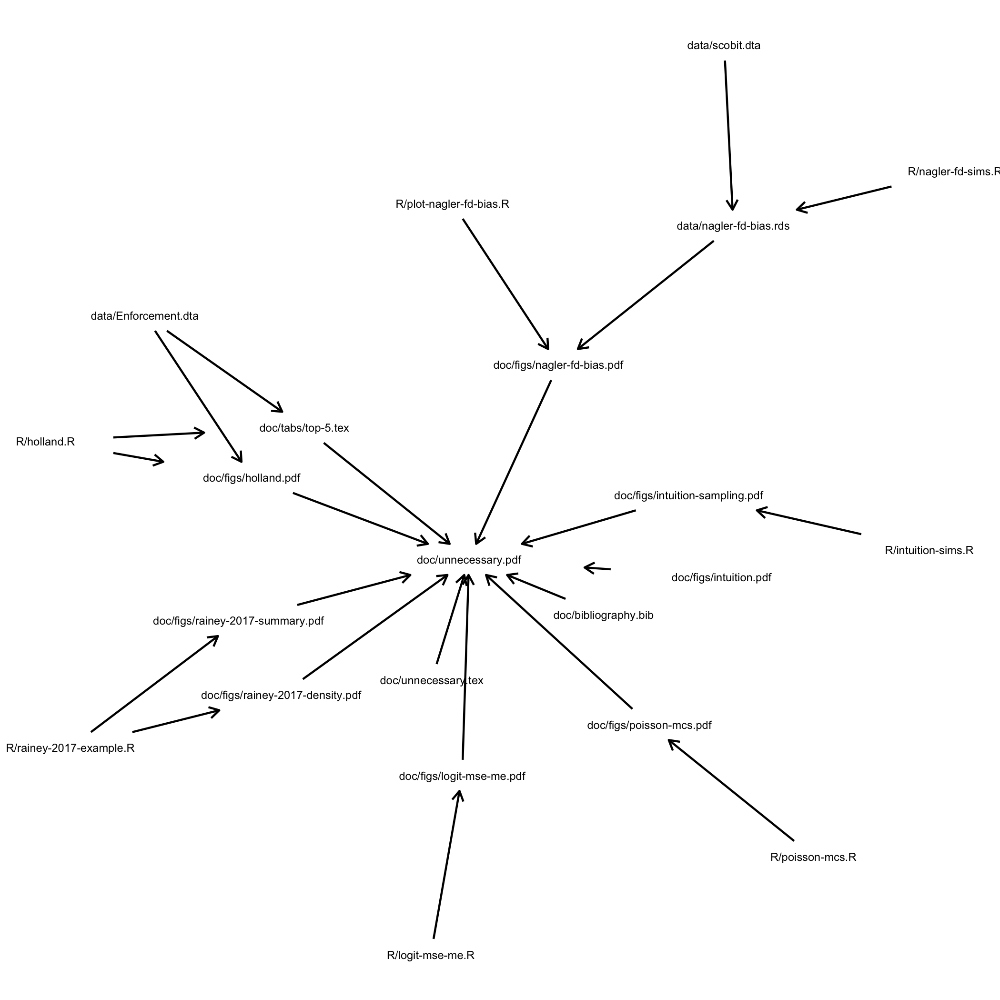

This repository contains the manuscript and code for paper "A Careful Consideration of CLARIFY: Simulation-Induced Bias in Point Estimates of Quantities of Interest."

> Some work in political methodology recommends that applied researchers obtain point estimates of quantities of interest by simulating model coefficients, transforming these simulated coefficients into simulated quantities of interest, and then averaging the simulated quantities of interest (e.g., CLARIFY). But other work advises applied researchers to directly transform coefficient estimates to estimate quantities of interest. I point out that these two approaches are not interchangeable and examine their properties. I show that the simulation approach compounds the transformation-induced bias identified by Rainey (2017), adding bias with direction and magnitude similar to the transformation-induced bias. I refer to this easily-avoided additional bias as "simulation-induced bias." Even if researchers use simulation to estimate standard errors, they should directly transform maximum likelihood estimates of coefficient estimates to obtain point estimates of quantities of interest.

## Reproduction

### Using Individual R Scripts

This project is simple, so it is easy to reproduce the analyses by running two R scripts individually.

- `R/intuition-sims.R` reproduces the simulations for the "drastic, convex transformation" and creates `doc/figs/fig1-intuition.pdf` and `doc/figs/fig2-intuition-sims.pdf` (the `fig*` numbers correspond to the figure numbers in the paper).
- `R/holland.R` reproduces the re-analysis of Holland (2015) and creates `doc/figs/fig3-holland.pdf` and `doc/tabs/tab1-top-5.tex`. The file `holland-medians.csv` contains the median shrinkage in Bogota, Lima, Santiago reported in the text.

You can run the two R scripts with the `source()` commands below.

```
source("R/intuition-sims.R")
source("R/holland.R"")
```

### Using the `Makefile`

To reproduce this work, simply run the command `make` in a terminal. This reproduces all computations and compiles the manuscript and appendix. It takes about three minutes to run on my desktop.

- `make` or `make all` makes the entire project (simulations, data analysis, manuscript, and appendix).
- `make paper` makes the manuscript and appendix.

#### Cleaning the Directory

- `make cleanALL` deletes all files created by scripts. 
- `make cleanpaper` deletes the `.pdf` versions of the manuscript and appendix. 

#### Dependencies

The figure below shows the dependencies.


